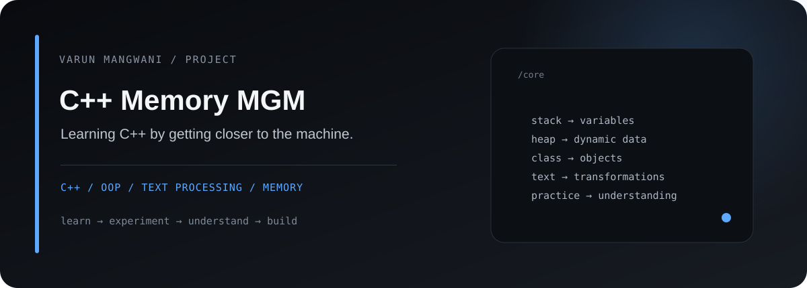
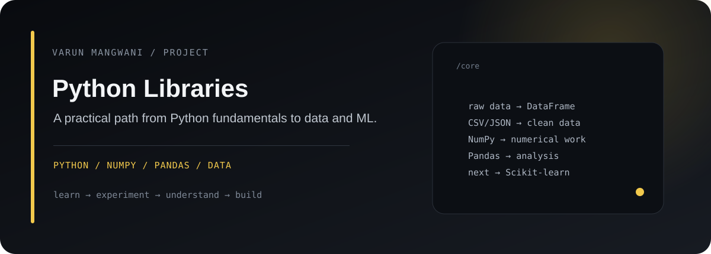
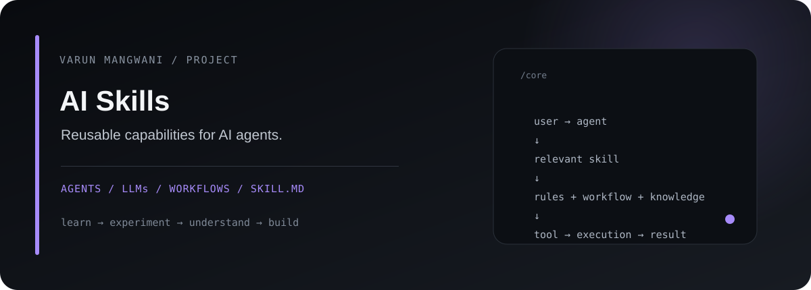
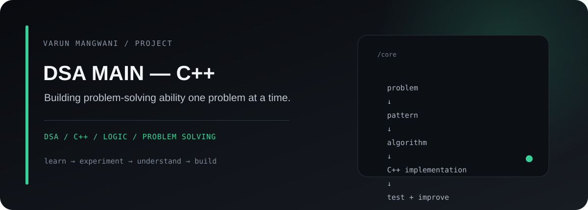

<div align="center">


# Varun Mangwani

### Software Developer • AI/ML Learner • Builder

<a href="https://git.io/typing-svg">

</a>

<p>
<a href="https://github.com/Varun-Mangwani"></a>
<a href="https://www.linkedin.com/in/varun-mangwani"></a>
<a href="https://www.instagram.com/str_veer"></a>
</p>

</div>

---

## About

I'm **Varun**, a BCA student building a strong foundation in software development while moving toward **AI/ML**.

I like understanding what happens underneath the abstractions — from C++ memory and data structures to Python data processing and reusable AI-agent workflows.

**Current direction:** `C++ → DSA → Python → Data → AI/ML`

---

## What I'm working on

| Area | Focus |
|---|---|
| **C++** | OOP, memory, text processing, problem solving |
| **DSA** | Algorithms, patterns, implementation and consistency |
| **Python** | Core Python, NumPy, Pandas and data workflows |
| **AI/ML** | ML foundations and practical experiments |
| **AI Agents** | Reusable skills, workflows and `SKILL.md` instructions |

---

# Projects

### 01 — C++ Memory MGM

<a href="https://github.com/Varun-Mangwani/Cpp-Memory-MGM">

</a>

A C++ learning repository covering **OOP, text processing, experiments and day-by-day practice**.

`C++` `OOP` `Memory` `Text Processing`

[View repository →](https://github.com/Varun-Mangwani/Cpp-Memory-MGM)

---

### 02 — Python Libraries

<a href="https://github.com/Varun-Mangwani/Python-Libraries">

</a>

My practical Python ecosystem journey. The repository currently focuses heavily on **NumPy and Pandas**, including DataFrames, CSV/JSON handling, cleaning, datasets and analysis, with Scikit-learn planned as the next step.

`Python` `NumPy` `Pandas` `Data Analysis` `Scikit-learn`

[View repository →](https://github.com/Varun-Mangwani/Python-Libraries)

---

### 03 — AI Skills

<a href="https://github.com/Varun-Mangwani/Ai-Skills/tree/Skills">

</a>

An open-source collection of **reusable AI-agent skills, prompts, workflows and `SKILL.md` instructions** for coding, research, automation, productivity and other agent workflows.

`AI Agents` `LLMs` `Automation` `Workflows` `SKILL.md`

[View Skills branch →](https://github.com/Varun-Mangwani/Ai-Skills/tree/Skills)

---

### 04 — DSA MAIN — C++

<a href="https://github.com/Varun-Mangwani/DSA_MAIN-CPP-">

</a>

A focused C++ repository for building **DSA and problem-solving consistency** from the ground up.

`C++` `DSA` `Algorithms` `Problem Solving`

[View repository →](https://github.com/Varun-Mangwani/DSA_MAIN-CPP-)

---

## Learning path

```text
                    SOFTWARE DEVELOPMENT
                           │
             ┌─────────────┴─────────────┐
             ▼                           ▼
           C++                         Python
             │                           │
             ▼                           ▼
            DSA                     NumPy / Pandas
             │                           │
             └─────────────┬─────────────┘
                           ▼
                       Data + Logic
                           │
                           ▼
                       AI / ML
                           │
                           ▼
                    AI Applications
```

---

## Tech stack

<div align="center">


</div>

---

## GitHub

<div align="center">


<br />


</div>

---

## Beyond the code

I share parts of my learning journey, experiments and development process online.

<div align="center">

<a href="https://varun.dpdns.org/">

</a>
<a href="https://www.linkedin.com/in/varun-mangwani">

</a>
<a href="https://www.instagram.com/str_veer">

</a>

</div>

---

<div align="center">

### Build → Break → Understand → Rebuild


</div>
